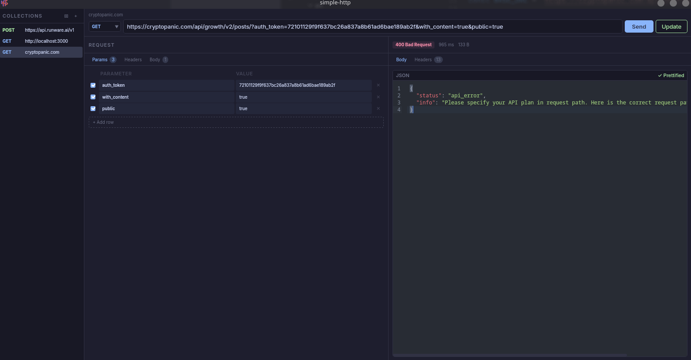

<div align="center">

#  Simple HTTP

A fast, lightweight, native HTTP client — no Electron, no bloat.

[](https://tauri.app)
[](https://react.dev)
[](https://www.rust-lang.org)
[](LICENSE)

</div>

---

## About

Popular HTTP clients like Postman and Insomnia ship with too many features you'll never use — and they all run on Electron. Simple HTTP is a minimalistic alternative built with **Tauri 2** and **Rust**, so it stays fast and lightweight while covering the essentials.


## Features

- **All standard HTTP methods** — GET, POST, PUT, PATCH, DELETE, HEAD, OPTIONS
- **Headers & query params** — editable key-value pairs with toggle support
- **Request body** — JSON, form data, and raw body types
- **Syntax-highlighted editor** — powered by CodeMirror with One Dark theme
- **Request collections** — save, organize into groups, and quickly switch between requests
- **Response inspector** — status, headers, body, timing, and size at a glance
- **Keyboard shortcuts** — send requests and save without leaving the keyboard
- **Native performance** — Rust backend with reqwest; no Electron overhead
- **Persistent storage** — your requests are saved locally between sessions

## Tech Stack

| Layer    | Technology                          |
| -------- | ----------------------------------- |
| Backend  | Rust, Tauri 2, reqwest              |
| Frontend | React 19, TypeScript, Tailwind CSS  |
| Editor   | CodeMirror 6                        |
| Build    | Vite, pnpm                          |

## Getting Started

### Prerequisites

- [Rust](https://www.rust-lang.org/tools/install) (latest stable)
- [Node.js](https://nodejs.org) (v18+)
- [pnpm](https://pnpm.io/installation)
- System dependencies for Tauri — see the [Tauri prerequisites guide](https://v2.tauri.app/start/prerequisites/)

### Project Setup

- [VS Code](https://code.visualstudio.com/) + [Tauri](https://marketplace.visualstudio.com/items?itemName=tauri-apps.tauri-vscode) + [rust-analyzer](https://marketplace.visualstudio.com/items?itemName=rust-lang.rust-analyzer)

```bash
# Clone the repository
git clone https://github.com/your-username/simple-http.git
cd simple-http

# Install frontend dependencies
pnpm install

# Run in development mode
pnpm tauri dev
```

### Building for Production

```bash
pnpm tauri build
```

The compiled binary will be in `src-tauri/target/release/`.

## Project Structure

```
simple-http/
├── src/                  # React frontend
│   ├── components/       # UI components (Sidebar, RequestPanel, ResponsePanel, …)
│   ├── types.ts          # Shared TypeScript types
│   └── App.tsx           # Main application component
├── src-tauri/            # Rust backend
│   ├── src/lib.rs        # Tauri commands & HTTP logic
│   └── tauri.conf.json   # Tauri configuration
├── public/               # Static assets
└── package.json
```

## Contributing

Contributions are welcome! Feel free to open an issue or submit a pull request.

1. Fork the repository
2. Create your feature branch (`git checkout -b feature/amazing-feature`)
3. Commit your changes (`git commit -m 'Add amazing feature'`)
4. Push to the branch (`git push origin feature/amazing-feature`)
5. Open a Pull Request

## License

Distributed under the MIT License. See [`LICENSE.md`](./LICENSE.md) for more information.
